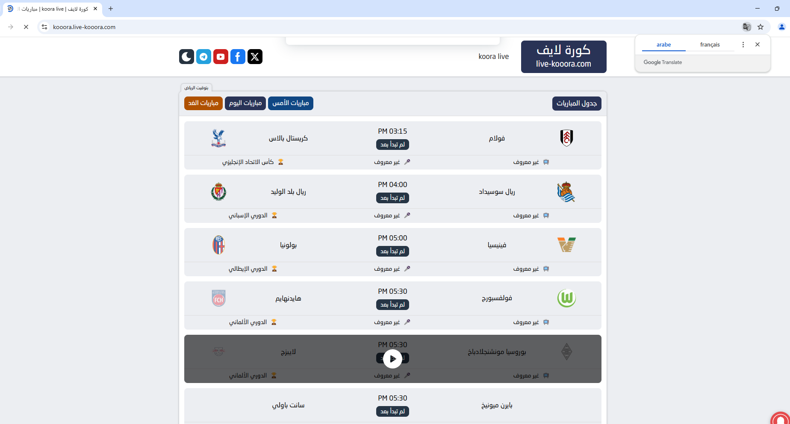

# Kooora Broadcast Tracker

**Kooora Broadcast Tracker** is a Python-based web scraper designed to monitor live football matches on [Kooora](https://kooora.live). It scrapes match details, captures screenshots of live broadcasts, and exports parsed data to CSV files. The project is modular, robust, and handles Arabic text seamlessly using UTF-8 encoding.

## Table of Contents
- [Overview](#overview)
- [Features](#features)
- [Prerequisites](#prerequisites)
- [Installation](#installation)
- [Usage](#usage)
- [Outputs](#outputs)
- [Screenshots](#screenshots)
- [Contributing](#contributing)
- [License](#license)

## Overview

The Kooora Broadcast Tracker automates the process of scraping live football match information from Kooora. Key functionalities include:
- Scraping match details such as teams, channels, and broadcast status.
- Capturing high-quality screenshots of live match broadcasts.
- Exporting parsed data to timestamped CSV files.
- Handling Arabic text with UTF-8 encoding for seamless logging and output.

## Features

- **Scraping**: Efficiently extracts match details from Kooora's live stream pages.
- **Screenshot Capture**: Automatically takes screenshots of live broadcasts.
- **CSV Export**: Saves scraped data in structured CSV files for easy analysis.
- **Logging**: Detailed logs for debugging and monitoring.
- **Anti-Detection**: Uses stealthy browser configurations to avoid detection by anti-bot systems.

## Prerequisites

- **Python 3.8+**
- **Dependencies**:
  - `beautifulsoup4`
  - `undetected-chromedriver`
  - `selenium`
  - `pandas`

## Installation

1. **Clone the Repository**:
   ```bash
   git clone https://github.com/yourusername/KoooraBroadcastTracker.git
   cd KoooraBroadcastTracker
   ```

2. **Create a Virtual Environment**:
   ```bash
   python -m venv env
   source env/bin/activate  # On Linux/macOS
   env\Scripts\activate     # On Windows
   ```

3. **Install Dependencies**:
   ```bash
   pip install -r requirements.txt
   ```

4. **Configure Settings**:
   - Edit `config.py` to set the target URL and other parameters if needed.

## Usage

1. **Run the Script**:
   ```bash
   python main.py
   ```

2. **Outputs**:
   - **CSV Files**: Saved in the `output/` directory.
   - **Screenshots**: Saved in the `Screenshots/` directory.
   - **Logs**: Saved in the `logs/` directory.

## Outputs

### CSV Output Example

The script generates CSV files with the following columns:
- `batch_time`: Timestamp of the scrape.
- `teams`: Names of the teams playing.
- `channel`: Broadcasting channel.
- `status`: Match status (`Broadcasted`, `Reported`, or `Finished`).
- `page_url`: URL of the match page.
- `match_url`: URL of the match video (if available).
- `screenshot_url`: Path to the screenshot file (if captured).

Example CSV row:
```
batch_time,teams,channel,status,page_url,match_url,screenshot_url
2025-03-28T21:14:00,بيراميدز VS البنك الأهلي,beIN Sports,Broadcasted,https://kooora.live-kooora.com/match/12345,https://example.com/video/12345,screenshots/بيراميدز_VS_البنك_الأهلي_20250328_211400.png
```

### Screenshot Example

The script captures screenshots of live broadcasts and saves them in the `Screenshots/` directory. Here’s an example:


## Screenshots

### Chrome Driver Running

The script uses Selenium with `undetected-chromedriver` to interact with the website. Below is a screenshot of the Chrome browser running during the scraping process:



### CSV Output

The script generates CSV files containing detailed match information. Below is a preview of the CSV output:


## Contributing

Contributions are welcome! Please open an issue or submit a pull request.

## License

This project is licensed under the MIT License. See the [LICENSE](LICENSE) file for details.

## Contact

For questions or feedback, contact [Your Name] at [Your Email].
